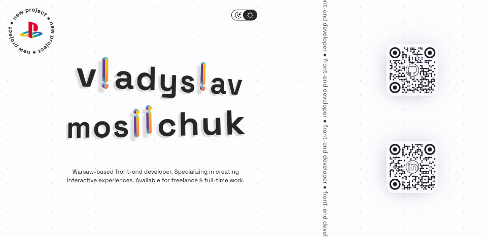

# Web Developer Portfolio – vmosiichuk.dev

The portfolio is developed using HTML5, CSS3, and JavaScript. Designed to provide an immersive experience, the portfolio invites exploration and interaction. Custom styles are applied to establish a distinct visual identity. Notably, the use of COLRv1 fonts plays a pivotal role in enhancing typography and elevating the overall design. This portfolio is a representation of my commitment to crafting seamless user experiences while incorporating interactive elements that engage and captivate users.

### Interactivity
Built with a strong emphasis on interactivity, this portfolio enables users to effortlessly toggle between light and dark modes to suit to their preferences. This is done to enhance user engagement, as well as, provide a visually comfortable browsing experience.

### Design
Central to this portfolio is its design aesthetics. The use of color gradients, typography choices, and thoughtful layout designs ensure that each section is not only informative but also aesthetically pleasing. Carefully curated color schemes and fonts contribute to a harmonious and professional appearance.

### Responsiveness
The portfolio's responsiveness ensures that users experience consistency on various screen sizes, whether they're browsing on a desktop, tablet, or smartphone. This user-centric approach prioritizes accessibility and effortless navigation.

### COLRv1 & Custom Color Palettes
A distinctive feature of this portfolio is the incorporation of COLRv1 fonts, that create a visually rich and captivating typographical experience. Unlike traditional fonts, COLRv1 allows for smooth gradients, sharp highlights, and blended shadows. As a result, COLRv1 fonts help to transform text from simple means of communication, into an integral part of the design narrative. The project features two hand-picked color palettes designed specifically for light and dark modes.
